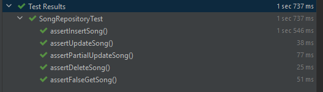

## Music Manager MongoDb Model

## Insertions

In my Application class I generate Songs and also obe Album with all these Songs.

## Results

## Spring Mongorepository and Customrepository

### SongRepository

    @Repository
    public interface SongRepository extends MongoRepository<Song,String>, CustomSongRepository {
    
        Song findByMusicTitle(String musicTitle);
    
    }

My SongRepository implements from two other repos. The MongoRepository 
and a CustomSongRepository.

My CustomSongRepository has own made queries with MongoTemplate.

The MongoRepository provides pre-defined queries.
You can do easy stuff like searching, creating, deleting or updating
with the parameters you want.

MongoRepository is a big help, but sometimes we need more complex queries. 
Updating with MongoRepository would need to fetch the whole object 
from the Database and save it again.

example:

        song = songRepository.findById(id);
        song.setGenre("Rock");
        songRepository.save(song);

### Partial Update CustomSongRepositoryImpl.java

With the help of MongoTemplate, we can write more complex queries, like an update that only updates
a field of an object.
 
    mongoTemplate.findAndModify(BasicQuery.query(Criteria.where("id").is(songId)),
                BasicUpdate.update(fieldName,fieldValue), FindAndModifyOptions.none(), Song.class);

### Test results from the SongRepository

 

